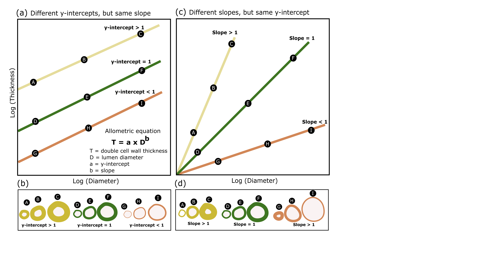

<!-- Improved compatibility of back to top link: See: https://github.com/othneildrew/Best-README-Template/pull/73 -->
<a name="readme-top"></a>
<!--
*** Thanks for checking out the Best-README-Template. If you have a suggestion
*** that would make this better, please fork the repo and create a pull request
*** or simply open an issue with the tag "enhancement".
*** Don't forget to give the project a star!
*** Thanks again! Now go create something AMAZING! :D
-->


<!-- PROJECT SHIELDS -->
<!--
*** I'm using markdown "reference style" links for readability.
*** Reference links are enclosed in brackets [ ] instead of parentheses ( ).
*** See the bottom of this document for the declaration of the reference variables
*** for contributors-url, forks-url, etc. This is an optional, concise syntax you may use.
*** https://www.markdownguide.org/basic-syntax/#reference-style-links
-->
[![Contributors][contributors-shield]][contributors-url]
[![Forks][forks-shield]][forks-url]
[![Stargazers][stars-shield]][stars-url]
[![Issues][issues-shield]][issues-url]
[![MIT License][license-shield]][license-url]
[![LinkedIn][linkedin-shield]][linkedin-url]


<!-- PROJECT LOGO -->
<br />
<div align="center">
  <a href="https://github.com/ilamatos/xylem_implosion_safety">
    
  </a>

<h3 align="center">Leaf xylem implosion safety</h3>

  <p align="center">
   Data and Rcode to reproduce analysis of the manuscript entitled "Leaf conduits grow wider than thicker and are vulnerable to implosion"
    <br />
    <a href="https://github.com/ilamatos/xylem_implosion_safety"><strong>Explore the docs »</strong></a>
    <br />
    <br />
    <a href="https://github.com/ilamatos/xylem_implosion_safety">View Demo</a>
    ·
    <a href="https://github.com/ilamatos/xylem_implosion_safety/issues">Report Bug</a>
    ·
    <a href="https://github.com/ilamatos/xylem_implosion_safety/issues">Request Feature</a>
  </p>
</div>


<!-- TABLE OF CONTENTS -->
<details>
  <summary>Table of Contents</summary>
  <ol>
    <li>
      <a href="#about-the-project">About the project </a>
      </ul>
    </li>
      <a href="#statistical-analysis">Statistical Analysis</a>
      <ul>
    </li>
      <a href="#getting-started">Getting Started</a>
      <ul>
        <li><a href="#prerequisites">Prerequisites</a></li>
        <li><a href="#installation">Installation</a></li>
      </ul>
    </li>
    <li><a href="#usage">Usage</a></li>
    <li><a href="#roadmap">Roadmap</a></li>
    <li><a href="#contact">Contact</a></li>
    <li><a href="#acknowledgments">Acknowledgments</a></li>
  </ol>
</details>


<!-- ABOUT THE PROJECT -->
## About The Project
Vascular plants developed lignified conduits (tracheids and vessel elements) in the xylem tissue to transport water with relatively high efficiency (Sperry 2003). Because of the extreme negative pressures experienced in the xylem, these conduits are under risk of dysfunction (Figure 1a) either by cavitation (i.e. the collapse of water columns due to formation and expansion of air bubbles) or by implosion (i.e. the collapse of conduit walls due to compression forces) (Sperry and Hacke 2004, Hacke et al 2004). For a long time, physiological work on xylem dysfunction has focused on cavitation as the main process responsible for reduced hydraulic efficiency in plants under drought, while much less is know about the leaf xylem safety against implosion (Zhang et al 2023).

To a first approximation, conduit safety against implosion is proportional to the ratio between double-wall thickness (T in Figure 1) and maximum lumen diameter (D), i.e. T/D (also called ‘‘thickness-to-span’’ ratio, Hacke et al., 2001; Sperry et al 2006). Thus, implosion safety can theoretically be increased either by having narrower conduits or by having thicker conduits (Jacobson et al 2005, Pittermann et al 2016). Either way (narrowing or thickening conduits) may result in functional disadvantages for the plant (Blackman et al 2010; Pratt and Jacobsen 2017, Pittermann et al 2016): narrowing conduits results in decreased flow efficiency (Sperry et al 2006), whereas thickening conduits results in increased construction cost (Niklas 1992, Brodribb and Holbrook 2005).

Therefore, plants may need to trade-off implosion safety  versus maximum efficiency at a minimum construction cost. Assuming linear trade-offs between those different leaf functions, we could expect leaves to scale T proportionally to D in order to achieve a level of conduit reinforcement (T/D) that is “just right” given the risk of failure relative to the fixed cost of construction (Blackman et al 2018; Hacke et al 2001; Escheverria et al 2022). That is, the relationship between log (T) vs. log (D) should have an allometric slope close to 1 (isometric growth) (Figure 1). If thickening occurs too fast (slope >1 = positive allometry), conduits might be more safe against implosion and also mechanically stronger, but they are also more costly to produce and less efficient in conducting water. If widening occurs too fast (slope <1 = negative allometry), conduits might be less costly to produce and more efficient in conducting water, but at the expense of being potentially more vulnerable to implosion and less mechanically reinforced.  

Species growing under different selective pressures may prioritize different leaf functions, so we should expect some developmental variation in the T x D scaling slopes across plant phylogeny (i.e. slope may depart from 1 in some species), creating an optimal range of scaling factors within boundary conditions set by biophysical and physiological constraints (Figure 1). For example, species growing in dry habitats experience more xylem tension (more negative water potentials) and are likely under higher selection pressure for developing safer vessels (thicker and/or narrower conduits) compared to species in wet environments (Blackman et al 2018). Similarly, xylem tension increases from the petiole to the minor veins, so we could expect a variation in implosion safety across vein orders.
This research project investigates leaf xylem implosion safety on a phylogenetically diverse set of 122 ferns and angiosperms species with different habitats and growth forms. For each species, we also measured traits describing leaf mechanical support, hydraulic efficiency and construction cost and tested for potential trade-offs between leaf functions. 

Specifically we asked: 
- (Q1) Do leaf conduits’ double cell wall thickness (T) and lumen maximum diameter (D) scale to each other isometrically (i.e. slope = 1)? 
- (Q2) How does the slope of the T vs. D scaling varies across species and clades, habitat (arid, mesic, hydric), growth forms (aquatic, herb, climbing, tree, shrub), and vein orders (major, medium, minor)?
- (Q3) Is there a multiple trade-off between implosion safety, mechanical support, hydraulic efficiency and construction cost?

<!-- FIGURE 1 -->
<br />
<div align="left">
  <a href="https://github.com/ilamatos/xylem_implosion_safety">
    
  </a>

<h3 align="left">Figure 1</h3>
(a)Three scaling scenarios for the log–log relationship between leaf conduit double wall thickness (T) and lumen diameter (D): slope >1 (yellow area)- conduits grow thicker than wider, resulting in greater xylem reinforcement and lower vulnerability to implosion in wider conduits; slope = 1 (green area)- conduits diameter and thickness grow proportionally, resulting in a constant safety implosion across vein sizes; and slope < 1 (orange area)-  conduits grow wider than thicker, resulting in greater xylem reinforcement in smaller conduits, but higher vulnerability to implosion in wider conduits. Slope may slightly depart from 1 in some species, creating an optimal range of scaling factors within boundary conditions set by biophysical and physiological constraints. (b) Illustrations of how conduits T and D are expected to vary across vein sizes in each of the three scaling scenarios. (c) Functional (normal) and dysfunctional (cavitated and collapsed) leaf conduits. Cavitation occurs when air bubbles form and expand inside the conduits blocking the water flow. Collapse or implosion occurs when radial (force orientated towards the conduit center) or hoop (force exerted around the conduit circumference) forces (indicated by the gray arrows) create mechanical stress that exceeds the wall strength, so that the wall implose (buckles inwards).

<p align="left">(<a href="#readme-top">back to top</a>)</p>

<!-- STATISTICAL ANALYSIS -->
## Statistical analysis
Analysis

<!-- GETTING STARTED -->
## Getting Started

You will need R version 4.3.1 (or greater) and the following R-packages installed and loaded in your computer to run the Rcode to reproduce the analysis of this project

### Prerequisites

* npm
  ```sh
  npm install npm@latest -g
  ```

### Installation

1. Get a free API Key at [https://example.com](https://example.com)
2. Clone the repo
   ```sh
   git clone https://github.com/ilamatos/xylem_implosion_safety.git
   ```
3. Install NPM packages
   ```sh
   npm install
   ```
4. Enter your API in `config.js`
   ```js
   const API_KEY = 'ENTER YOUR API';
   ```

<p align="right">(<a href="#readme-top">back to top</a>)</p>


<!-- USAGE EXAMPLES -->
## Usage

Use this space to show useful examples of how a project can be used. Additional screenshots, code examples and demos work well in this space. You may also link to more resources.

_For more examples, please refer to the [Documentation](https://example.com)_

<p align="right">(<a href="#readme-top">back to top</a>)</p>


<!-- ROADMAP -->
## Roadmap

- [ ] Feature 1
- [ ] Feature 2
- [ ] Feature 3
    - [ ] Nested Feature

See the [open issues](https://github.com/ilamatos/xylem_implosion_safety/issues) for a full list of proposed features (and known issues).

<p align="right">(<a href="#readme-top">back to top</a>)</p>


<!-- CONTRIBUTING -->
## Contributing

Contributions are what make the open source community such an amazing place to learn, inspire, and create. Any contributions you make are **greatly appreciated**.

If you have a suggestion that would make this better, please fork the repo and create a pull request. You can also simply open an issue with the tag "enhancement".
Don't forget to give the project a star! Thanks again!

1. Fork the Project
2. Create your Feature Branch (`git checkout -b feature/AmazingFeature`)
3. Commit your Changes (`git commit -m 'Add some AmazingFeature'`)
4. Push to the Branch (`git push origin feature/AmazingFeature`)
5. Open a Pull Request

<p align="right">(<a href="#readme-top">back to top</a>)</p>


<!-- LICENSE -->
## License

Distributed under the MIT License. See `LICENSE.txt` for more information.

<p align="right">(<a href="#readme-top">back to top</a>)</p>


<!-- CONTACT -->
## Contact

Ilaine Silveira Matos - ilaine.matos@gmail.com

Project Link: [https://github.com/ilamatos/xylem_implosion_safety](https://github.com/ilamatos/xylem_implosion_safety)

<p align="right">(<a href="#readme-top">back to top</a>)</p>


<!-- ACKNOWLEDGMENTS -->
## Acknowledgments

* []()
* []()
* []()

<p align="right">(<a href="#readme-top">back to top</a>)</p>


<!-- MARKDOWN LINKS & IMAGES -->
<!-- https://www.markdownguide.org/basic-syntax/#reference-style-links -->
[contributors-shield]: https://img.shields.io/github/contributors/ilamatos/xylem_implosion_safety.svg?style=for-the-badge
[contributors-url]: https://github.com/ilamatos/xylem_implosion_safety/graphs/contributors
[forks-shield]: https://img.shields.io/github/forks/ilamatos/xylem_implosion_safety.svg?style=for-the-badge
[forks-url]: https://github.com/ilamatos/xylem_implosion_safety/network/members
[stars-shield]: https://img.shields.io/github/stars/ilamatos/xylem_implosion_safety.svg?style=for-the-badge
[stars-url]: https://github.com/ilamatos/xylem_implosion_safety/stargazers
[issues-shield]: https://img.shields.io/github/issues/ilamatos/xylem_implosion_safety.svg?style=for-the-badge
[issues-url]: https://github.com/ilamatos/xylem_implosion_safety/issues
[license-shield]: https://img.shields.io/github/license/ilamatos/xylem_implosion_safety.svg?style=for-the-badge
[license-url]: https://github.com/ilamatos/xylem_implosion_safety/blob/master/LICENSE.txt
[linkedin-shield]: https://img.shields.io/badge/-LinkedIn-black.svg?style=for-the-badge&logo=linkedin&colorB=555
[linkedin-url]: https://linkedin.com/in/linkedin_username
[product-screenshot]: images/screenshot.png
[Next.js]: https://img.shields.io/badge/next.js-000000?style=for-the-badge&logo=nextdotjs&logoColor=white
[Next-url]: https://nextjs.org/
[React.js]: https://img.shields.io/badge/React-20232A?style=for-the-badge&logo=react&logoColor=61DAFB
[React-url]: https://reactjs.org/
[Vue.js]: https://img.shields.io/badge/Vue.js-35495E?style=for-the-badge&logo=vuedotjs&logoColor=4FC08D
[Vue-url]: https://vuejs.org/
[Angular.io]: https://img.shields.io/badge/Angular-DD0031?style=for-the-badge&logo=angular&logoColor=white
[Angular-url]: https://angular.io/
[Svelte.dev]: https://img.shields.io/badge/Svelte-4A4A55?style=for-the-badge&logo=svelte&logoColor=FF3E00
[Svelte-url]: https://svelte.dev/
[Laravel.com]: https://img.shields.io/badge/Laravel-FF2D20?style=for-the-badge&logo=laravel&logoColor=white
[Laravel-url]: https://laravel.com
[Bootstrap.com]: https://img.shields.io/badge/Bootstrap-563D7C?style=for-the-badge&logo=bootstrap&logoColor=white
[Bootstrap-url]: https://getbootstrap.com
[JQuery.com]: https://img.shields.io/badge/jQuery-0769AD?style=for-the-badge&logo=jquery&logoColor=white
[JQuery-url]: https://jquery.com 
